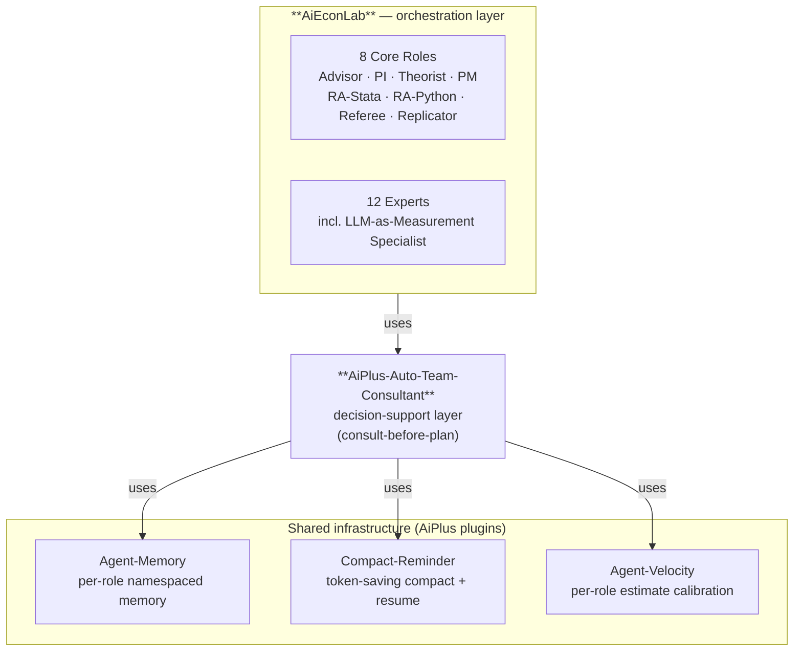

# AiEconLab (AEL)
[](LICENSE)

[中文 README](README.zh-CN.md)

I've been writing applied-economics papers with AI assistants for over a year
— mostly Claude Code, sometimes Codex, OpenCode for long replication runs.
For the first few months it felt magical. Then I noticed the same things
breaking every paper, every session: I'd ask the agent to clean data on
Monday, by Friday it had forgotten my variable names. I'd ask the same chat
to write the intro AND debug Stata, and the intro started reading like
Stata syntax. When I asked for an identification strategy critique, it gave
me prose that mixed referee voice with my own. **One agent wearing every
hat does each hat shallowly — just like one person trying to be PI + RA +
Theorist + Referee simultaneously would.**

AiEconLab gives your AI a research team structure instead. You get a
**PI**, two **RAs** (one Stata, one Python), a **Theorist**, a **Referee**,
a **Replicator**, a **PM**, and an **Advisor** — eight role-separated
agents, each with its own memory, workspace, and personality, plus 12
specialist experts (Lit Reviewer, Writer, Econometrician, **LLM-as-
Measurement Specialist**, Reproducibility Engineer, …) the PI summons when
the task calls for it. You talk to Advisor and PI; PI handles the rest.


## The pains an applied-econ AI workflow keeps hitting

If you've been driving an AI assistant through a real research project, these
probably feel familiar:

1. **The agent forgets your paper between sessions.** Monday you teach it the
   variable conventions for your panel. Wednesday it asks again. By Friday
   you have re-explained your identification strategy four times.
2. **One chat does everything, badly.** You asked the same window to argue
   the IV exclusion restriction, debug a Stata syntax error, and draft a
   paragraph for the intro — now the intro paragraph references `gen` and
   `egen`, and the IV critique is buried under printlns.
3. **Long projects burn tokens on `/compact`.** Either you `/compact`-ed too
   late (agent has been re-reading 20K-token history every turn for hours)
   or too early (next session burns its first 20% re-explaining your
   identification strategy you already nailed down).
4. **Plan-time blind spots cost a referee response cycle.** The agent
   drafted a submission plan that missed IRB renewal, missed data-sharing
   restrictions on the historical archive, missed a Stata version dependency
   that breaks AEA reviewer's replication run. You find out in R&R.
5. **Estimates anchor on human-engineer hours.** Agent says "this takes 5
   hours" for a robustness table. Twenty minutes later it's done. No one
   keeps the score, so next time it says 5 hours again.
6. **Cross-paper amnesia.** Six months tuning the agent to your workflow on
   Paper A — naming style, identification taste, robustness habits, referee
   voice. Paper B starts and the agent has never met you.

AEL + the AiPlus substrate it sits on treat all six pains. AEL specifically
fixes the **role-separation** part (pain #2) and **plan-time blind spots**
(pain #4) with an applied-econ-tuned consultant team. Memory, compact, key
storage, velocity calibration, and the cross-project profile bundle come
from [AiPlus](https://github.com/izhiwen/AiPlus) and its companion
[AiPlus-Work-with-Me](https://github.com/izhiwen/AiPlus-Work-with-Me).

## What you get — eight roles, each with its own desk

You install AEL into a project once. Then:

- **PI** — your research lead. Owns the high-level plan, decides who
  works on what, integrates results back. The PI is who you talk to when
  you say "let's pivot the spec," "what's blocking the submission?",
  "summarize where we are."
- **Theorist** — argues identification, instruments, exclusion
  restrictions, structural assumptions. Doesn't write code; writes
  critiques of your strategy.
- **RA-Stata** — does only Stata. Cleans data, runs regressions,
  produces tables. Its memory is "what your variables mean and how your
  panel is shaped," not "what your intro paragraph says."
- **RA-Python** — does only Python. Same role as RA-Stata, different
  toolchain. Runs in parallel in its own git worktree, so the two RAs
  can't silently overwrite each other.
- **Referee** — pre-reads your draft like a real referee would. Catches
  the IV exclusion holes, the missing first-stage F-stat, the unaddressed
  reverse-causality story before you submit.
- **Replicator** — exists to break your replication package. Re-runs
  your pipeline on a clean machine, surfaces dependency drift, AEA
  data-editor blockers, missing seed values.
- **PM** — keeps milestones, deadlines, blockers, and submission
  calendars. The role you talk to when you ask "what's due Friday?"
- **Advisor** — meta-reviewer for the project itself. The role you
  talk to when you're stuck deciding *what* to do, not *how*.

Plus a **12-specialist expert directory** (Lit Reviewer, Writer,
Econometrician, **LLM-as-Measurement Specialist**, Reproducibility
Engineer, Historical Sources, Job Talk Coach, Survey-Experiment Designer,
Computation, Coauthor Liaison, IRB-Disclosure Specialist, Contribution-
Framing Coach) the PI summons when a task matches their triggers.

Default toolchain: **Python + Stata + LaTeX**. R and Julia supported when
you declare them in your project config.

### 🔬 The LLM-as-Measurement Specialist (AEL's killer role)

If your paper uses LLMs to score archival or unstructured text — and if
that scoring is going to drive an empirical result — the validity
question matters more than the prompt-engineering. AEL's **LLM-as-
Measurement Specialist** codifies the methodology I developed for treating
LLMs as a measurement instrument: multi-LLM agreement, held-out
validation, inter-rater statistics, prompt-version stability.

The reproducible companion to this role:
[**Multi-LLM-Validation-Demo**](https://github.com/izhiwen/Multi-LLM-Validation-Demo)
— 294 19th-century Classical Chinese documents independently scored by
**ChatGPT, Gemini, Claude, Qwen, and DeepSeek**; pairwise score
correlations 0.85–0.95 (mean 0.92). Public-facing companion to my JMP,
*Democratic Exposure and Elite Ideology: Evidence from Treaty Ports in
Imperial China*.


## Install — three commands

AEL runs on top of [AiPlus](https://github.com/izhiwen/AiPlus). If you
haven't installed AiPlus yet:

```bash
curl -fsSL https://raw.githubusercontent.com/izhiwen/AiPlus/main/install.sh | bash
```

Then in your research project:

```bash
cd MyPaperProject
aiplus install claude-code       # or: codex, opencode, all
aiplus add aieconlab
```

That's it. `aiplus agent status` will now show 8 core research roles
(Advisor / PI / Theorist / PM / RA-Stata / RA-Python / Referee / Replicator)
plus 12 expert seats sitting dormant on the bench.

### Verify

```bash
aiplus agent status              # show the team roster
aiplus agent doctor              # validate worktrees, memory layout, configs
```

## Daily use — talk to PI, PI talks to the team

Most of the time you just route through the PI:

```bash
aiplus agent route pi "estimate the main IV spec with cluster-robust SEs"
# PI scores task → picks RA-Stata → returns regression output

aiplus agent route pi "draft the introduction paragraph linking exposure → outcome"
# PI scores task → picks Writer expert + Theorist → returns prose

aiplus agent route pi "prepare referee response to the IV exogeneity criticism"
# PI scores task → picks Referee + Theorist + Writer → returns draft response
```

You can also talk to a specific role directly:

```bash
aiplus agent talk ra-stata       # direct chat with RA-Stata
aiplus agent talk theorist       # direct chat with Theorist
aiplus agent invite lit-reviewer # bring an expert onto the active roster
aiplus agent dismiss lit-reviewer
aiplus agent transcript          # see recent role activity (audit trail)
```

When work needs integrating back into your main branch:

```bash
aiplus agent integrate ra-stata  # merge RA-Stata's worktree back
aiplus agent audit run           # full acceptance audit before submission
```

## Why "team" rather than "one smarter agent"

Three concrete reasons, observed across my own paper drafts:

1. **Memory stays clean.** RA-Stata's memory holds your variable
   conventions and Stata habits. It doesn't get polluted by intro-paragraph
   experiments or referee tone. When you come back to a Stata task three
   weeks later, the RA picks up where it left off without a 5-minute
   re-orientation.
2. **Two RAs work in parallel without overwriting each other.** Each
   code-touching role gets its own git worktree, so RA-Stata cleaning
   the panel and RA-Python plotting figures can both run live. Conflicts
   surface through git, not through "what happened to my .do file?"
3. **The Referee actually reads like a referee.** Because the Referee
   role has only ever seen referee briefs and rebuttal letters in its
   persona memory — not your debug logs, not your variable definitions —
   it produces critiques in the right voice and catches what a real
   referee catches.

There's also a **PI-fires-consultant-before-MEDIUM/HEAVY-tasks** layer that
runs an applied-econ-tuned 5-seat plan-time review before risky moves:
identification strategy changes, paper-section rewrites, submission prep,
data-share decisions, IRB renewals. So the agent stops drafting submission
plans that miss IRB renewal until the last weekend.

## Architecture at a glance

AEL is the orchestration layer. It sits on top of `auto-team-consultant`
(plan-time review) and three shared infrastructure plugins from the AiPlus
substrate:



Plain-text fallback for renderers without mermaid:

```
                  aieconlab             ← orchestration layer
                           ↓ uses
               AiPlus-Auto-Team-Consultant           ← decision-support layer
                           ↓ uses
    AiPlus-Agent-Memory  AiPlus-Compact-Reminder  AiPlus-Agent-Velocity
               ←——————— shared infrastructure layer ———————→
```

## Co-existence with software-engineering teams

If you also maintain a software replication package or a code library
that goes with the paper, AEL's sibling
[**AiPlus-Agent-Team**](https://github.com/izhiwen/AiPlus-Agent-Team)
ships a parallel structure with software-engineering roles (Architect,
Engineer-A, Engineer-B, Reviewer, QA). The two can coexist in the same
project — `aiplus agent set-team aieconlab` to switch into research mode,
`aiplus agent set-team agent-team` to switch into engineering mode.

## Safety boundaries

AEL stays inside your project. It does not:

- upload agent state, persona, memory, or transcript anywhere
- run as a background daemon or persistent process
- store secrets, IRB-protected paths, or restricted archive locations in
  any role's persona, memory, or workspace
- modify global agent config (`~/.codex`, `~/.claude`, `~/.opencode`)
- modify another project's `.aiplus/`
- auto-approve **Owner-gated** actions: submit to journal, send referee
  response, share data, push paper to public archive, claim authorship
  order
- introduce new network calls beyond what your runtime already makes

## More

- **Main platform**: [AiPlus](https://github.com/izhiwen/AiPlus)
- **Sibling team for software engineering**: [AiPlus-Agent-Team](https://github.com/izhiwen/AiPlus-Agent-Team)
- **Cross-project profile bundle**: [AiPlus-Work-with-Me](https://github.com/izhiwen/AiPlus-Work-with-Me)
- **LLM-as-Measurement worked example**:
  [Multi-LLM-Validation-Demo](https://github.com/izhiwen/Multi-LLM-Validation-Demo)
  (294 archival docs × 5 frontier LLMs, pairwise ρ 0.85–0.95)
- **In-place beta walkthrough**: [`docs/beta-walkthrough.md`](docs/beta-walkthrough.md)
  — honest log of what works today vs what doesn't, against current
  AiPlus + AEL HEAD
- **Design rationale, routing protocol, memory model**:
  [`DESIGN.md`](DESIGN.md)
- **Acceptance schema** (binding, every behavioral change must update it):
  `.aiplus/aieconlab/acceptance/v0.1.0/schema.yaml`

## Contributing

We welcome contributions that stay within AEL's scope: role separation
and execution for applied-econ research (not software engineering, not
generic advisory).

1. **Open an issue first** for anything bigger than a typo.
2. **Follow the existing TOML + markdown persona pattern** — config in
   `.aiplus/agents/<role>.toml`, persona prompt in
   `.aiplus/agents/personas/<role>.md`.
3. **Adapter parity** — if you touch CLI surface, update all three
   adapters (`adapters/codex/`, `adapters/claude-code/`, `adapters/opencode/`).
4. **Run `aiplus agent doctor`** after config changes.
5. **Acceptance criteria are binding** — any behavioral change must
   update the schema and its sibling `.test.sh`.

## License

[Apache-2.0](LICENSE)
