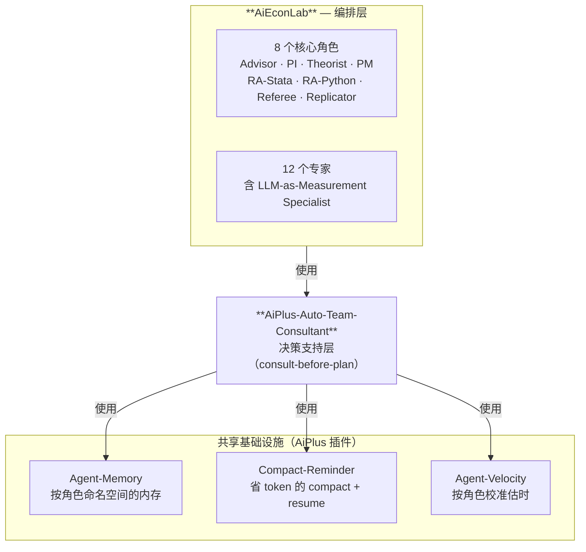

# AiEconLab (AEL)
[](LICENSE)

[English README](README.md)

我用 AI 助手写应用经济学论文已经一年多了——平时主要 Claude Code，偶尔 Codex
拿第二意见，长 replication 任务上 OpenCode。前几个月感觉像魔法。然后我开始发现每篇
论文每个 session 都在重复踩同样的坑：周一教过它面板数据的变量约定，周五又问；让同一个
对话窗口**同时**写 intro 和 debug Stata——结果 intro 段落里冒出 `gen` 和 `egen`；
让它给一个 identification 策略的批评，给我的是混着 referee 口吻和我自己声音的散文。
**一个 agent 戴所有帽子，每顶帽子都戴得很浅——就跟一个人想同时当 PI + RA + Theorist +
Referee 一样**。

AiEconLab 把你的 AI 重新组织成一个研究团队结构。你会拿到一个 **PI**、两个 **RA**
（一个 Stata、一个 Python）、一个 **Theorist**、一个 **Referee**、一个
**Replicator**、一个 **PM**、一个 **Advisor**——八个角色分离的 agent，每个都有自己
的记忆、工作区、人格——再加 12 个专家席（Lit Reviewer / Writer / Econometrician /
**LLM-as-Measurement Specialist** / Reproducibility Engineer / 历史档案 /
Job Talk Coach / ...），PI 看任务对口才召唤。你只跟 Advisor 和 PI 对话；PI 调度其余人。


## 应用经济学 AI 工作流每天都在踩的坑

如果你已经在用 AI 助手跑过几篇真实论文，下面这些可能很熟：

1. **Agent 跨 session 把你的论文忘个干净。** 周一教它你面板的变量约定，周三又问。
   到周五，identification 策略已经讲过四遍。
2. **一个对话窗口干所有事，干得都浅。** 同一个窗口你让它论证 IV 排除约束、debug
   Stata 语法、起草 intro 段落——结果 intro 段落里出现 `gen` 和 `egen`，IV 批评
   被埋在 printlns 下面。
3. **长项目在 `/compact` 上烧 token。** 要么 `/compact` 晚了（agent 几小时来每轮
   都在重读 20K token 历史）；要么 `/compact` 早了（下一个 session 头 20% 重新
   解释你刚刚定下来的 identification 策略）。
4. **Plan-time 盲区让你多走一轮 R&R。** Agent 起草的提交计划漏了 IRB 续期、漏了
   档案的数据共享限制、漏了一个让 AEA 复现 reviewer 跑不通的 Stata 版本依赖。
   你 R&R 的时候才发现。
5. **估时锚定"人类工程师小时数"。** Agent 报"做一张 robustness 表 5 小时"，结果
   20 分钟干完。下次还是报 5 小时。没人记账。
6. **跨论文失忆。** 你花六个月把 agent 调教成懂你工作流的样子——naming 风格、
   identification 品味、robustness 习惯、referee 口吻。下一篇论文开张，agent
   还是从零开始。

AEL + 它底下的 AiPlus 一起治这六件事。AEL 自己专门治**角色分离**（#2）和
**plan-time 盲区**（#4，用一个应用经济学专调的 consultant 团队）。记忆、compact、
key 存储、估时校准、跨项目 profile 包来自 [AiPlus](https://github.com/izhiwen/AiPlus)
和姊妹模板 [AiPlus-Work-with-Me](https://github.com/izhiwen/AiPlus-Work-with-Me)。

## 你拿到什么——8 个角色，每个都有自己的桌子

装一次 AEL 进项目，你就有：

- **PI**——你的研究负责人。管高层 plan，决定谁做什么，把结果整合回来。你说
  "我们换个 spec 思路"、"提交还差什么"、"现在卡在哪"——都是跟 PI 说。
- **Theorist**——专门吵 identification、instruments、排除约束、结构性假设。
  不写代码，写你策略的批评。
- **RA-Stata**——只做 Stata。清数据、跑回归、出表。它的记忆是"你的变量是什么意思、
  面板长什么样"，**不是**"你的 intro 段落写到哪儿了"。
- **RA-Python**——只做 Python。跟 RA-Stata 同角色不同工具链。在自己的 git
  worktree 里并行跑，两个 RA 不会悄悄覆盖对方的文件。
- **Referee**——像真 referee 一样预读你的稿子。在你提交之前抓出 IV 排除约束的
  漏洞、缺的 first-stage F-stat、没回应的 reverse-causality 故事。
- **Replicator**——存在的目的就是搞砸你的 replication package。在干净机器上
  重跑你的 pipeline，找出依赖漂移、AEA data editor 会卡的地方、丢的 seed。
- **PM**——管 milestone、截止日期、blocker、提交日程。你说"周五要交什么"——找 PM。
- **Advisor**——项目本身的 meta-reviewer。你在纠结**该做什么**（不是**怎么做**）
  的时候，找 Advisor。

外加 **12 个专家席**（Lit Reviewer / Writer / Econometrician /
**LLM-as-Measurement Specialist** / Reproducibility Engineer / 历史档案 /
Job Talk Coach / Survey Experiment Designer / Computation / Coauthor Liaison /
IRB-Disclosure Specialist / Contribution Framing Coach），任务匹配到触发词时 PI 召唤。

默认工具链：**Python + Stata + LaTeX**。R 和 Julia 在项目里声明后也支持。

### 🔬 LLM-as-Measurement Specialist（AEL 的杀手锏）

如果你的论文用 LLM 给档案文本或非结构化文本打分——并且这个评分要变成 empirical
结果——**validity 问题**比 prompt engineering 重要得多。AEL 的
**LLM-as-Measurement Specialist** 把我在 JMP 里发展的方法论编码进 agent：
multi-LLM agreement、held-out validation、inter-rater statistics、
prompt-version stability。

这个角色的可复现 demo：[**Multi-LLM-Validation-Demo**](https://github.com/izhiwen/Multi-LLM-Validation-Demo)
——294 篇 19 世纪文言档案，由 **ChatGPT / Gemini / Claude / Qwen / DeepSeek**
独立打分；两两相关 0.85–0.95（均值 0.92）。是我 JMP《Democratic Exposure and
Elite Ideology: Evidence from Treaty Ports in Imperial China》的公开伴生材料。


## 安装——三条命令

AEL 跑在 [AiPlus](https://github.com/izhiwen/AiPlus) 上。还没装 AiPlus 的话：

```bash
curl -fsSL https://raw.githubusercontent.com/izhiwen/AiPlus/main/install.sh | bash
```

然后在你的论文项目目录里：

```bash
cd MyPaperProject
aiplus install claude-code       # 或：codex, opencode, all
aiplus add aieconlab
```

就这样。`aiplus agent status` 会显示 8 个研究角色
（Advisor / PI / Theorist / PM / RA-Stata / RA-Python / Referee / Replicator）
+ 12 个专家席静默 standby。

### 验证

```bash
aiplus agent status              # 看团队 roster
aiplus agent doctor              # 校验 worktree、内存布局、配置
```

## 日常使用——跟 PI 对话，PI 跟团队对话

大多数时候 route 到 PI 就行：

```bash
aiplus agent route pi "用 cluster-robust SE 跑主 IV spec"
# PI 打分 → 派 RA-Stata → 回报回归输出

aiplus agent route pi "起草 intro 段落把 exposure → outcome 连起来"
# PI 打分 → 派 Writer 专家 + Theorist → 回报文字

aiplus agent route pi "准备针对 IV 排除约束批评的 referee response"
# PI 打分 → 派 Referee + Theorist + Writer → 回报草稿
```

也可以直接跟具体角色聊：

```bash
aiplus agent talk ra-stata       # 直接跟 RA-Stata 对话
aiplus agent talk theorist       # 直接跟 Theorist 对话
aiplus agent invite lit-reviewer # 把一个专家请进活跃 roster
aiplus agent dismiss lit-reviewer
aiplus agent transcript          # 看最近的角色活动（audit trail）
```

工作需要整合回主分支时：

```bash
aiplus agent integrate ra-stata  # 把 RA-Stata 的 worktree merge 回来
aiplus agent audit run           # 提交前跑完整 acceptance audit
```

## 为什么是"团队"而不是"一个更聪明的 agent"

三个我自己写论文实测出来的理由：

1. **记忆干净。** RA-Stata 的记忆只装你的变量约定和 Stata 习惯，不会被 intro
   实验或者 referee 口吻污染。三周后回来跑新的 Stata 任务，RA 直接接着干，
   不用再 5 分钟重新 orient。
2. **两个 RA 并行不踩对方。** 每个写代码的角色有自己的 git worktree，所以
   RA-Stata 清面板 + RA-Python 画图可以同时跑。冲突走 git，不会出现"我的 .do
   文件去哪儿了"。
3. **Referee 真的像 referee。** Referee 角色的人格记忆里只见过 referee brief
   和 rebuttal letter——没见过你的 debug log 和变量定义——所以它的批评是真
   referee 的口吻，抓的也是真 referee 会抓的东西。

另外还有一层 **PI-fires-consultant-before-MEDIUM/HEAVY-tasks**：风险动作
（identification 策略变更、论文段落重写、提交准备、数据共享决策、IRB 续期）之前会
跑一个应用经济学专调的 5-seat plan-time review。所以 agent 不再起草那种"R&R
最后一周才发现 IRB 没续"的提交计划。

## 架构一览

AEL 是编排层。它坐在 `auto-team-consultant`（plan-time 评审）和 AiPlus 底座的
三个基础设施 plugin 之上：



不支持 mermaid 的渲染器看这个：

```
                  aieconlab             ← 编排层
                           ↓ 使用
               AiPlus-Auto-Team-Consultant           ← 决策支持层
                           ↓ 使用
    AiPlus-Agent-Memory  AiPlus-Compact-Reminder  AiPlus-Agent-Velocity
               ←——————— 共享基础设施层 ———————→
```

## 跟软件工程团队共存

如果你同时还在维护一个伴随论文的 replication package 或代码库，AEL 的姊妹
[**AiPlus-Agent-Team**](https://github.com/izhiwen/AiPlus-Agent-Team)
是平行结构的软件工程团队（Architect / Engineer-A / Engineer-B / Reviewer / QA）。
两个可以共存在同一项目——`aiplus agent set-team aieconlab` 切研究模式，
`aiplus agent set-team agent-team` 切工程模式。

## 安全边界

AEL 留在你项目里，**不**：

- 上传 agent 状态、人格、记忆、transcript 到任何服务
- 后台 daemon 或常驻进程
- 在任何角色的人格 / 记忆 / 工作区里存 secret、IRB 保护路径、限制档案位置
- 改全局 agent 配置（`~/.codex`、`~/.claude`、`~/.opencode`）
- 改其他项目的 `.aiplus/`
- 自动批准 **Owner-gated** 动作：投稿、发 referee response、共享数据、
  推论文上公共档案、决定署名顺序
- 引入比你 runtime 本来就有的更多网络调用

## 更多

- **主平台**：[AiPlus](https://github.com/izhiwen/AiPlus)
- **软件工程姊妹团队**：[AiPlus-Agent-Team](https://github.com/izhiwen/AiPlus-Agent-Team)
- **跨项目 profile 包**：[AiPlus-Work-with-Me](https://github.com/izhiwen/AiPlus-Work-with-Me)
- **LLM-as-Measurement worked example**：
  [Multi-LLM-Validation-Demo](https://github.com/izhiwen/Multi-LLM-Validation-Demo)
  （294 篇档案 × 5 个前沿 LLM，两两 ρ 0.85–0.95）
- **In-place beta walkthrough**：[`docs/beta-walkthrough.md`](docs/beta-walkthrough.md)
  ——当前 AiPlus + AEL HEAD 上"什么能用、什么不能用"的诚实日志
- **设计理由、routing 协议、内存模型**：[`DESIGN.md`](DESIGN.md)
- **Acceptance schema**（binding，行为改动必须同步）：
  `.aiplus/aieconlab/acceptance/v0.1.0/schema.yaml`

## 贡献

欢迎在 AEL scope 内的贡献：应用经济学研究的角色分离与执行（不是软件工程，不是
通用 advisory）。

1. **大于 typo 的改动先开 issue。**
2. **遵循现有 TOML + markdown persona 模式**——config 放
   `.aiplus/agents/<role>.toml`，persona prompt 放
   `.aiplus/agents/personas/<role>.md`。
3. **Adapter parity**——CLI 表面有变更，三个 adapter 都要同步更新
   （`adapters/codex/`、`adapters/claude-code/`、`adapters/opencode/`）。
4. **改完跑 `aiplus agent doctor`** 校验 worktree、内存布局、TOML schema。
5. **Acceptance criteria 有约束力**——任何行为变更必须同步 schema 和它的
   `.test.sh`。

## License

[Apache-2.0](LICENSE)
